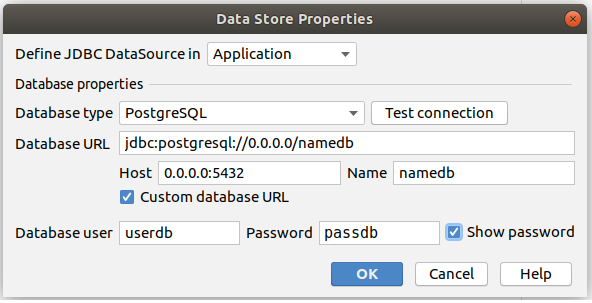

# Map

El presente proyecto está desarrollado en Java RAD framework  [Cuba Platform](https://www.cuba-platform.com/) y con el complemento [v-leaflet](https://vaadin.com/directory/component/v-leaflet) de vaadin.

## Inicializar base de datos con docker
Se ocupa postgreSQL como gestor de base de datos. Se adjunta el archivo docker-compose.yml, en el cual se setean los datos de la db, para luego conectar con el proyecto.

```
version: '3.3'
services:
    postgres:
        container_name: test
        environment:
            - POSTGRES_PASSWORD=passdb
            - POSTGRES_USER=userdb
            - POSTGRES_DB=namedb
        ports:
            - '5432:5432'
        volumes:
            - '$HOME/docker/volumes/postgres:/var/lib/postgresql/data'
        image: 'postgres:9.6'
```
Iniciar el contenedor, y al momento de finalizar este, se elimine, ejecutando el siguiente comando.
```
docker-compose up && docker-compose rm -fsv
```
## Conectar aplicación con bd

En la opción Cuba-> Main Data Storage Settings, ingresar parámetros de la bd antes mencionados en el archivo docker-compose.



Finalmente ejecutar aplicación e ingresar a [http://localhost:8080/app](http://localhost:8080/app/)

## Screen 1


## Screen 2


## Screen 3

